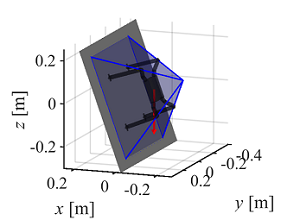

# ClimbLab - Climbing robot Matlab simulator

Author(s) and maintainer(s): [Space Robotics Lab.](http://www.astro.mech.tohoku.ac.jp/e/index.html) Climbing Robotics Team

The climbing simulator is being developed by the Climbing Robotics Team in [Space Robotics Laboratory](http://www.astro.mech.tohoku.ac.jp/e/index.html) at Tohoku University, Japan. 

The source code is released under a [BSD 3-Clause license](./LICENSE).

## Overview
This simulator wraps up functions for:
* [x] Dynamic analysis and simulation of articulated multi-body systems with a floating base (*This is performed by [SpaceDyn](https://github.com/Space-Robotics-Laboratory/SpaceDyn)* [1])
* [x] Design of legged robotic system
* [x] Environment demonstration (different terrain shape, inclination, and gravity)
* [x] Visualization (Robot, map, support polygons, stability criterion, and time-history of any state variables) 

#### Simulation examples
|  |  ||
|--------|--------|--------|
| 1) Standard gait on uneven terrain | 2) Optimal foothold selection on descrete grippable points [1] | 3) Stability region visualization [2] |

## Usage

If you use this simulator in academic context, please put citations of the following publications [1] and [2].

#### Requirements
We confirmed the code is working with:
* Matlab 2018b or higher
* [SpaceDyn](http://www.astro.mech.tohoku.ac.jp/spacedyn/) - a MATLAB Toolbox for Space and Mobile Robots (version 2, release 0)
  - SpaceDyn toolbox v2r0 is also installed by cloning this repository (under `lib/spacedyn_v2r0`)

#### Build and Run
* Download the files from this repository
* Open MATLAB
* Select `climbing_simulator/` as the current folder for MATLAB
  - You should see `dat/`, `lib/` and `src/` directories under it
* Setup the parameters as you want
* Run `climb_main.m` file (**Note: MATLAB might ask you to change folder or add path. Choose to "add path"**)

## Publications

[1] Kentaro Uno *et al*., "[Gait Planning for a Free-Climbing Robot Based on Tumble Stability](https://ieeexplore.ieee.org/document/8700455)", Proceedings of the 2019 IEEE/SICE International Symposium on System Integration (SII), Paris, France, 2019, pp. 289-294, [doi: 10.1109/SII.2019.8700455](https://doi.org/10.1109/SII.2019.8700455).

[2] Warley F. R. Ribeiro *et al*., "[Dynamic Equilibrium of Climbing Robots based on Stability Polyhedron for Gravito-Inertial Acceleration](https://clawar.org/conference-proceedings/clawar-conference/clawar-2020-proceedings/)", Proceedings of the 23rd International Conference on Climbing and Walking Robots and the Support Technologies for Mobile Machines, Moscow, Russian Federation, 2020, pp. 297-304, [doi: 10.13180/clawar.2020.24-26.08.18](https://doi.org/10.13180/clawar.2020.24-26.08.18).

## FAQ
Please contact us by sending an email to the following address if there is any question or suggestion.

    limb[at]astro.mech.tohoku.ac.jp
