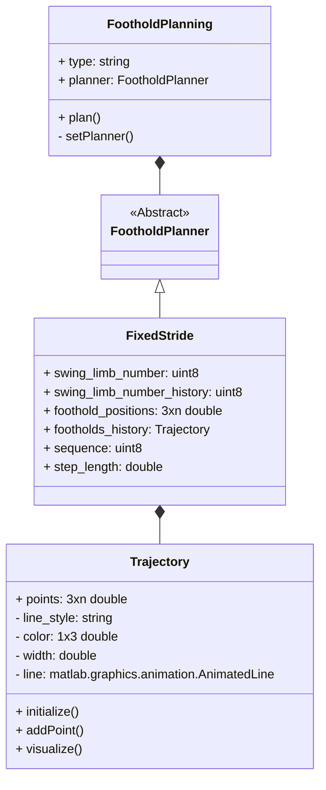

# Foothold Planning

```mermaid
classDiagram

  class FootholdPlanning {
    + type: string
    + planner: FootholdPlanner

    + plan()
    - setPlanner()
  }
  FootholdPlanning *-- FootholdPlanner

  class FootholdPlanner{
    <<Abstract>>
  }
  FootholdPlanner <|-- FixedStride

  class FixedStride {
    + swing_limb_number: uint8
    + swing_limb_number_history: uint8
    + foothold_positions: 3xn double
    + footholds_history: Trajectory
    + sequence: uint8
    + step_length: double
  }
  FixedStride *-- Trajectory

  class Trajectory {
    + points: 3xn double
    - line_style: string
    - color: 1x3 double
    - width: double
    - line: matlab.graphics.animation.AnimatedLine

    + initialize()
    + addPoint()
    + visualize()
  }

```
