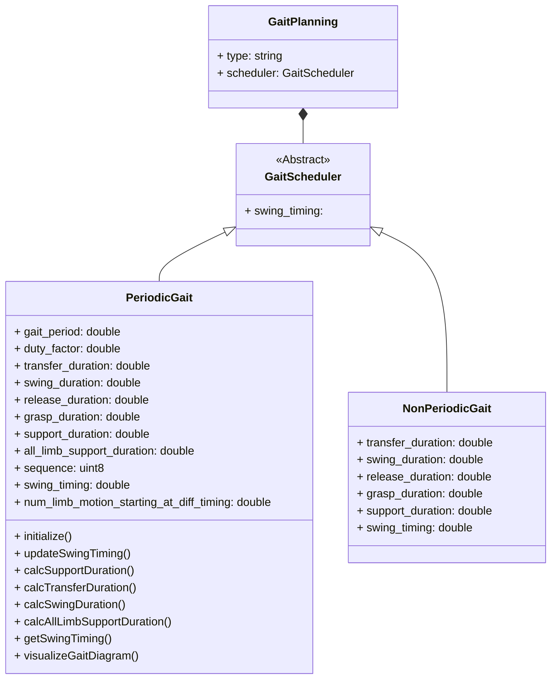

# Gait Planning

```mermaid
classDiagram

  class GaitPlanning {
    + type: string
    + scheduler: GaitScheduler
  }
  GaitPlanning *-- GaitScheduler

  class GaitScheduler {
  <<Abstract>>
    + swing_timing:
  }
  GaitScheduler <|-- PeriodicGait
  GaitScheduler <|-- NonPeriodicGait

  class PeriodicGait {
    + gait_period: double
    + duty_factor: double
    + transfer_duration: double
    + swing_duration: double
    + release_duration: double
    + grasp_duration: double
    + support_duration: double
    + all_limb_support_duration: double
    + sequence: uint8
    + swing_timing: double
    + num_limb_motion_starting_at_diff_timing: double

    + initialize()
    + updateSwingTiming()
    + calcSupportDuration()
    + calcTransferDuration()
    + calcSwingDuration()
    + calcAllLimbSupportDuration()
    + getSwingTiming()
    + visualizeGaitDiagram()
  }

  class NonPeriodicGait {
    + transfer_duration: double
    + swing_duration: double
    + release_duration: double
    + grasp_duration: double
    + support_duration: double
    + swing_timing: double
  }


```
