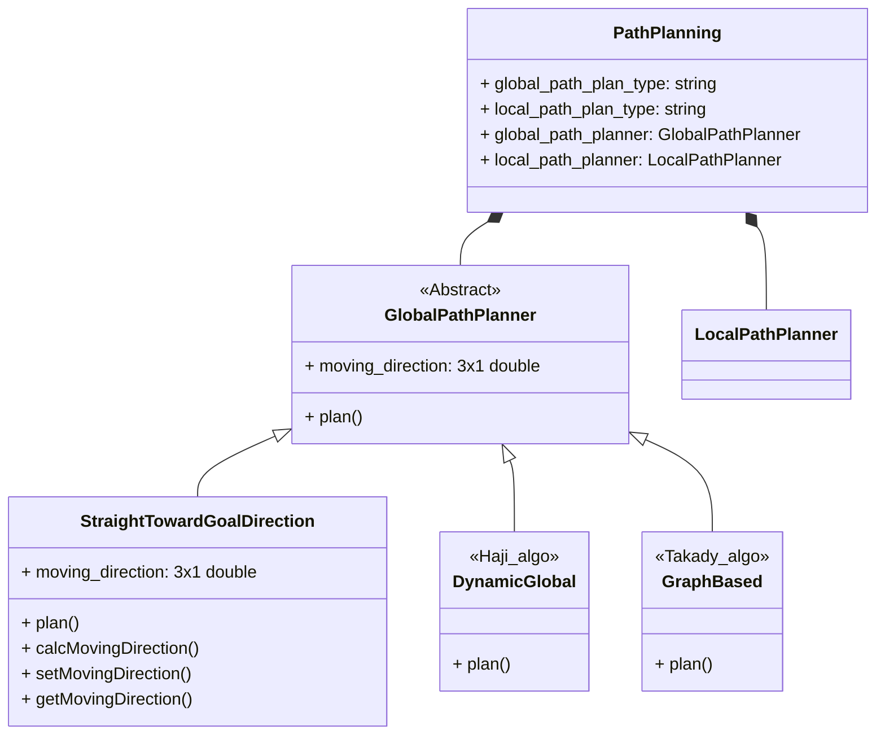

# Path Planning

```mermaid
classDiagram

  class PathPlanning {
    + global_path_plan_type: string
    + local_path_plan_type: string
    + global_path_planner: GlobalPathPlanner
    + local_path_planner: LocalPathPlanner
  }
  PathPlanning *-- GlobalPathPlanner
  PathPlanning *--  LocalPathPlanner

  class GlobalPathPlanner {
    <<Abstract>>
    + moving_direction: 3x1 double
    + plan()
  }
  GlobalPathPlanner <|-- StraightTowardGoalDirection
  GlobalPathPlanner <|-- DynamicGlobal
  GlobalPathPlanner <|-- GraphBased

  class StraightTowardGoalDirection {
    + moving_direction: 3x1 double
    + plan()
    + calcMovingDirection()
    + setMovingDirection()
    + getMovingDirection()
  }

  class DynamicGlobal {
    <<Haji_algo>>
    + plan()
  }

  class GraphBased {
    <<Takady_algo>>
    + plan()
  }

  class LocalPathPlanner {
  }


```
