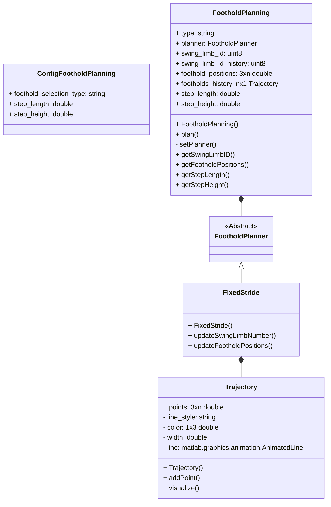

# Foothold Planning

```mermaid
classDiagram

  class ConfigFootholdPlanning {
    + foothold_selection_type: string
    + step_length: double
    + step_height: double
  }

  class FootholdPlanning {
    + type: string
    + planner: FootholdPlanner
    + swing_limb_id: uint8
    + swing_limb_id_history: uint8
    + foothold_positions: 3xn double
    + footholds_history: nx1 Trajectory
    + step_length: double
    + step_height: double

    + FootholdPlanning()
    + plan()
    - setPlanner()
    + getSwingLimbID()
    + getFootholdPositions()
    + getStepLength()
    + getStepHeight()
  }
  FootholdPlanning *-- FootholdPlanner

  class FootholdPlanner {
    <<Abstract>>
  }
  FootholdPlanner <|-- FixedStride

  class FixedStride {
  + FixedStride()
  + updateSwingLimbNumber()
  + updateFootholdPositions()
  }
  FixedStride *-- Trajectory

  class Trajectory {
    + points: 3xn double
    - line_style: string
    - color: 1x3 double
    - width: double
    - line: matlab.graphics.animation.AnimatedLine

    + Trajectory()
    + addPoint()
    + visualize()
  }

```
