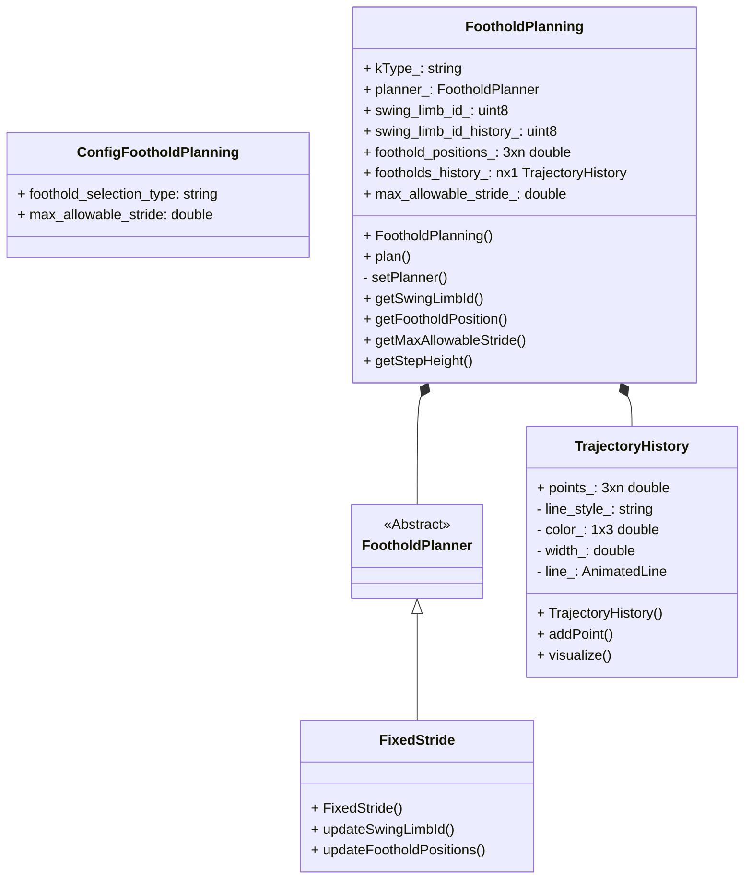

# Foothold Planning

```mermaid
classDiagram

  class ConfigFootholdPlanning {
    + foothold_selection_type: string
    + max_allowable_stride: double
  }

  class FootholdPlanning {
    + kType_: string
    + planner_: FootholdPlanner
    + swing_limb_id_: uint8
    + swing_limb_id_history_: uint8
    + foothold_positions_: 3xn double
    + footholds_history_: nx1 TrajectoryHistory
    + max_allowable_stride_: double

    + FootholdPlanning()
    + plan()
    - setPlanner()
    + getSwingLimbId()
    + getFootholdPosition()
    + getMaxAllowableStride()
    + getStepHeight()
  }
  FootholdPlanning *-- FootholdPlanner
  FootholdPlanning *-- TrajectoryHistory

  class FootholdPlanner {
    <<Abstract>>
  }
  FootholdPlanner <|-- FixedStride

  class FixedStride {
  + FixedStride()
  + updateSwingLimbId()
  + updateFootholdPositions()
  }

  class TrajectoryHistory {
    + points_: 3xn double
    - line_style_: string
    - color_: 1x3 double
    - width_: double
    - line_: AnimatedLine

    + TrajectoryHistory()
    + addPoint()
    + visualize()
  }

```
