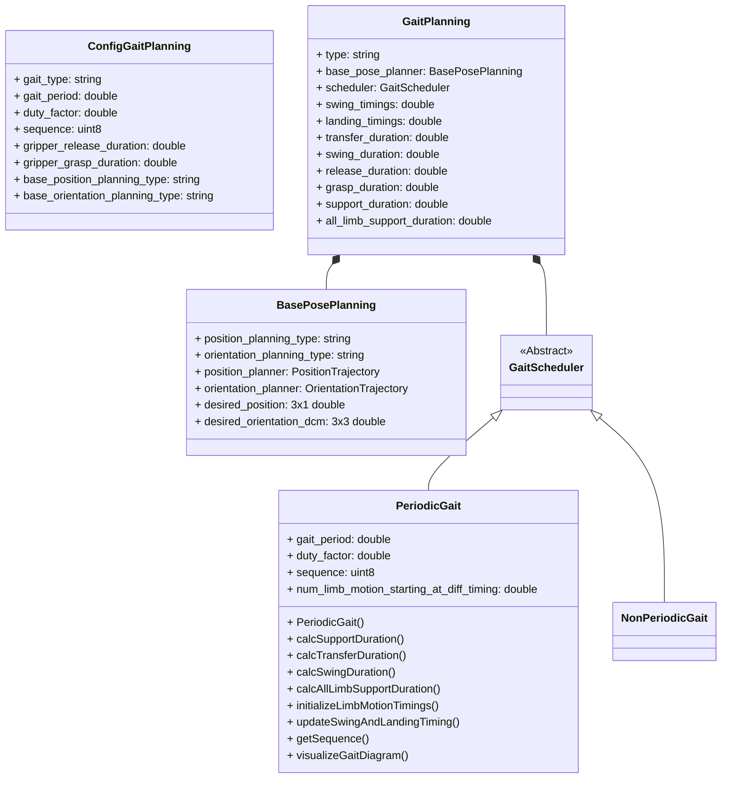

# Gait Planning

```mermaid
classDiagram

  class ConfigGaitPlanning {
    + gait_type: string
    + gait_period: double
    + duty_factor: double
    + sequence: uint8
    + gripper_release_duration: double
    + gripper_grasp_duration: double
    + base_position_planning_type: string
    + base_orientation_planning_type: string
  }

  class GaitPlanning {
    + type: string
    + base_pose_planner: BasePosePlanning
    + scheduler: GaitScheduler
    + swing_timings: double
    + landing_timings: double
    + transfer_duration: double
    + swing_duration: double
    + release_duration: double
    + grasp_duration: double
    + support_duration: double
    + all_limb_support_duration: double
  }
  GaitPlanning *-- BasePosePlanning
  GaitPlanning *-- GaitScheduler

  class BasePosePlanning {
    + position_planning_type: string
    + orientation_planning_type: string
    + position_planner: PositionTrajectory
    + orientation_planner: OrientationTrajectory
    + desired_position: 3x1 double
    + desired_orientation_dcm: 3x3 double
  }

  class GaitScheduler {
  <<Abstract>>
  }
  GaitScheduler <|-- PeriodicGait
  GaitScheduler <|-- NonPeriodicGait

  class PeriodicGait {
    + gait_period: double
    + duty_factor: double
    + sequence: uint8
    + num_limb_motion_starting_at_diff_timing: double

    + PeriodicGait()
    + calcSupportDuration()
    + calcTransferDuration()
    + calcSwingDuration()
    + calcAllLimbSupportDuration()
    + initializeLimbMotionTimings()
    + updateSwingAndLandingTiming()
    + getSequence()
    + visualizeGaitDiagram()
  }

  class NonPeriodicGait {
  }


```
