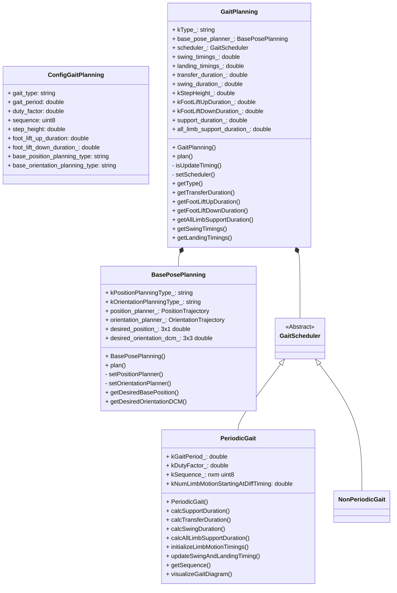

# Gait Planning

```mermaid
classDiagram

  class ConfigGaitPlanning {
    + gait_type: string
    + gait_period: double
    + duty_factor: double
    + sequence: uint8
    + step_height: double
    + foot_lift_up_duration: double
    + foot_lift_down_duration_: double
    + base_position_planning_type: string
    + base_orientation_planning_type: string
  }

  class GaitPlanning {
    + kType_: string
    + base_pose_planner_: BasePosePlanning
    + scheduler_: GaitScheduler
    + swing_timings_: double
    + landing_timings_: double
    + transfer_duration_: double
    + swing_duration_: double
    + kStepHeight_: double
    + kFootLiftUpDuration_: double
    + kFootLiftDownDuration_: double
    + support_duration_: double
    + all_limb_support_duration_: double

    + GaitPlanning()
    + plan()
    - isUpdateTiming()
    - setScheduler()
    + getType()
    + getTransferDuration()
    + getFootLiftUpDuration()
    + getFootLiftDownDuration()
    + getAllLimbSupportDuration()
    + getSwingTimings()
    + getLandingTimings()
  }
  GaitPlanning *-- BasePosePlanning
  GaitPlanning *-- GaitScheduler

  class BasePosePlanning {
    + kPositionPlanningType_: string
    + kOrientationPlanningType_: string
    + position_planner_: PositionTrajectory
    + orientation_planner_: OrientationTrajectory
    + desired_position_: 3x1 double
    + desired_orientation_dcm_: 3x3 double

    + BasePosePlanning()
    + plan()
    - setPositionPlanner()
    - setOrientationPlanner()
    + getDesiredBasePosition()
    + getDesiredOrientationDCM()
  }

  class GaitScheduler {
  <<Abstract>>
  }
  GaitScheduler <|-- PeriodicGait
  GaitScheduler <|-- NonPeriodicGait

  class PeriodicGait {
    + kGaitPeriod_: double
    + kDutyFactor_: double
    + kSequence_: nxm uint8
    + kNumLimbMotionStartingAtDiffTiming: double

    + PeriodicGait()
    + calcSupportDuration()
    + calcTransferDuration()
    + calcSwingDuration()
    + calcAllLimbSupportDuration()
    + initializeLimbMotionTimings()
    + updateSwingAndLandingTiming()
    + getSequence()
    + visualizeGaitDiagram()
  }

  class NonPeriodicGait {
  }


```
