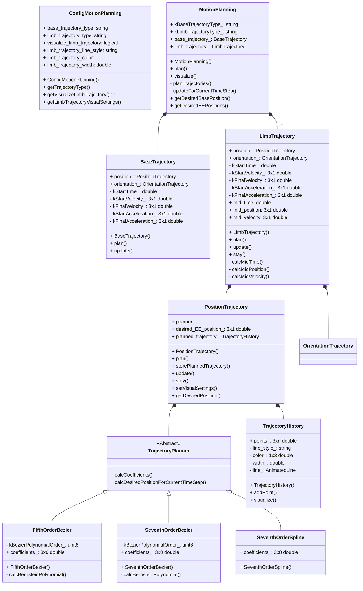

# Motion Planning

```mermaid
classDiagram

  class ConfigMotionPlanning {
    + base_trajectory_type: string
    + limb_trajectory_type: string
    + visualize_limb_trajectory: logical
    + limb_trajectory_line_style: string
    + limb_trajectory_color:
    + limb_trajectory_width: double

    + ConfigMotionPlanning()
    + getTrajectoryType()
    + getVisualizeLimbTrajectory()'
    + getLimbTrajectoryVisualSettings()
  }

  class MotionPlanning {
    + kBaseTrajectoryType_: string
    + kLimbTrajectoryType_: string
    + base_trajectory_: BaseTrajectory
    + limb_trajectory_: LimbTrajectory

    + MotionPlanning()
    + plan()
    + visualize()
    - planTrajectories()
    - updateForCurrentTimeStep()
    + getDesiredBasePosition()
    + getDesiredEEPositions()
  }
  MotionPlanning *-- BaseTrajectory
  MotionPlanning *-- "1.." LimbTrajectory

  class BaseTrajectory {
    + position_: PositionTrajectory
    + orientation_: OrientationTrajectory
    - kStartTime_: double
    - kStartVelocity_: 3x1 double
    - kFinalVelocity_: 3x1 double
    - kStartAcceleration_: 3x1 double
    - kFinalAcceleration_: 3x1 double

    + BaseTrajectory()
    + plan()
    + update()
  }

  class LimbTrajectory {
    + position_: PositionTrajectory
    + orientation_: OrientationTrajectory
    - kStartTime_: double
    - kStartVelocity_: 3x1 double
    - kFinalVelocity_: 3x1 double
    - kStartAcceleration_: 3x1 double
    - kFinalAcceleration_: 3x1 double
    + mid_time: double
    + mid_position: 3x1 double
    + mid_velocity: 3x1 double

    + LimbTrajectory()
    + plan()
    + update()
    + stay()
    - calcMidTime()
    - calcMidPosition()
    - calcMidVelocity()
  }
  LimbTrajectory *-- PositionTrajectory
  LimbTrajectory *-- OrientationTrajectory

  class PositionTrajectory {
    + planner_:
    + desired_EE_position_: 3x1 double
    + planned_trajectory_: TrajectoryHistory

    + PositionTrajectory()
    + plan()
    + storePlannedTrajectory()
    + update()
    + stay()
    + setVisualSettings()
    + getDesiredPosition()
  }
  PositionTrajectory *-- TrajectoryPlanner
  PositionTrajectory *-- TrajectoryHistory

  class TrajectoryPlanner {
    <<Abstract>>
    + calcCoefficients()
    + calcDesiredPositionForCurrentTimeStep()
  }
  TrajectoryPlanner <|-- FifthOrderBezier
  TrajectoryPlanner <|-- SeventhOrderBezier
  TrajectoryPlanner <|-- SeventhOrderSpline

  class FifthOrderBezier {
    - kBezierPolynomialOrder_: uint8
    + coefficients_: 3x6 double

    + FifthOrderBezier()
    - calcBernsteinPolynomial()
  }

  class SeventhOrderBezier {
    - kBezierPolynomialOrder_: uint8
    + coefficients_: 3x8 double

    + SeventhOrderBezier()
    - calcBernsteinPolynomial()
  }

  class SeventhOrderSpline {
    + coefficients_: 3x8 double

    + SeventhOrderSpline()
  }

  class TrajectoryHistory {
    + points_: 3xn double
    - line_style_: string
    - color_: 1x3 double
    - width_: double
    - line_: AnimatedLine

    + TrajectoryHistory()
    + addPoint()
    + visualize()
  }

```
