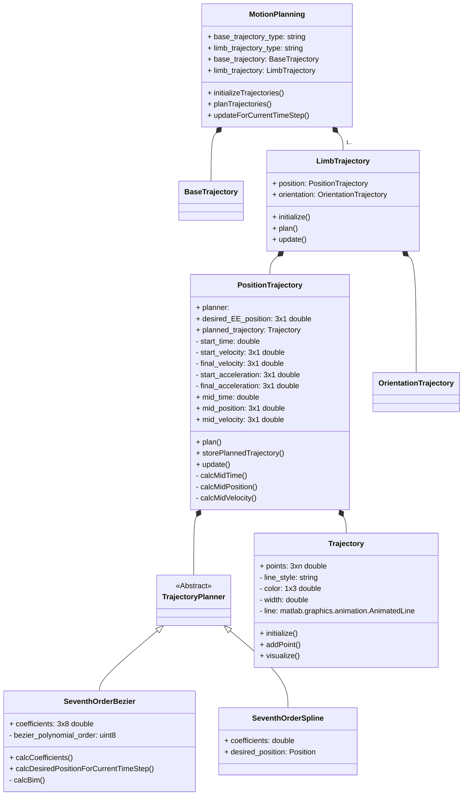

# Motion Planning

```mermaid
classDiagram

  class MotionPlanning {
    + base_trajectory_type: string
    + limb_trajectory_type: string
    + base_trajectory: BaseTrajectory
    + limb_trajectory: LimbTrajectory

    + initializeTrajectories()
    + planTrajectories()
    + updateForCurrentTimeStep()
  }
  MotionPlanning *-- BaseTrajectory
  MotionPlanning *-- "1.." LimbTrajectory

  class BaseTrajectory {
  }

  class LimbTrajectory {
    + position: PositionTrajectory
    + orientation: OrientationTrajectory

    + initialize()
    + plan()
    + update()
  }
  LimbTrajectory *-- PositionTrajectory
  LimbTrajectory *-- OrientationTrajectory

  class PositionTrajectory {
    + planner:
    + desired_EE_position: 3x1 double
    + planned_trajectory: Trajectory
    - start_time: double
    - start_velocity: 3x1 double
    - final_velocity: 3x1 double
    - start_acceleration: 3x1 double
    - final_acceleration: 3x1 double
    + mid_time: double
    + mid_position: 3x1 double
    + mid_velocity: 3x1 double

    + plan()
    + storePlannedTrajectory()
    + update()
    - calcMidTime()
    - calcMidPosition()
    - calcMidVelocity()
  }
  PositionTrajectory *-- TrajectoryPlanner
  PositionTrajectory *-- Trajectory

  class TrajectoryPlanner {
    <<Abstract>>
  }
  TrajectoryPlanner <|-- SeventhOrderBezier
  TrajectoryPlanner <|-- SeventhOrderSpline

  class SeventhOrderBezier {
    + coefficients: 3x8 double
    - bezier_polynomial_order: uint8

    + calcCoefficients()
    + calcDesiredPositionForCurrentTimeStep()
    - calcBim()
  }

  class SeventhOrderSpline {
    + coefficients: double
    + desired_position: Position
  }

  class Trajectory {
    + points: 3xn double
    - line_style: string
    - color: 1x3 double
    - width: double
    - line: matlab.graphics.animation.AnimatedLine

    + initialize()
    + addPoint()
    + visualize()
  }

```
