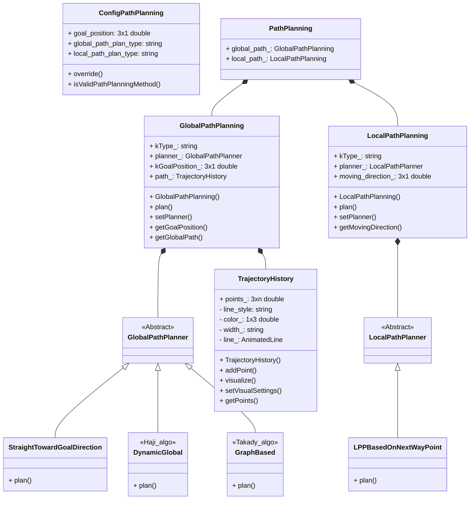

# Path Planning

```mermaid
classDiagram

  class ConfigPathPlanning {
    + goal_position: 3x1 double
    + global_path_plan_type: string
    + local_path_plan_type: string

    + override()
    + isValidPathPlanningMethod()
  }

  class PathPlanning {
    + global_path_: GlobalPathPlanning
    + local_path_: LocalPathPlanning
  }
  PathPlanning *-- GlobalPathPlanning
  PathPlanning *--  LocalPathPlanning

  class GlobalPathPlanning {
    + kType_: string
    + planner_: GlobalPathPlanner
    + kGoalPosition_: 3x1 double
    + path_: TrajectoryHistory

    + GlobalPathPlanning()
    + plan()
    + setPlanner()
    + getGoalPosition()
    + getGlobalPath()
  }
  GlobalPathPlanning *-- GlobalPathPlanner
  GlobalPathPlanning *-- TrajectoryHistory

  class GlobalPathPlanner {
    <<Abstract>>
  }
  GlobalPathPlanner <|-- StraightTowardGoalDirection
  GlobalPathPlanner <|-- DynamicGlobal
  GlobalPathPlanner <|-- GraphBased

  class StraightTowardGoalDirection {
    + plan()
  }

  class DynamicGlobal {
    <<Haji_algo>>
    + plan()
  }

  class GraphBased {
    <<Takady_algo>>
    + plan()
  }

  class TrajectoryHistory {
    + points_: 3xn double
    - line_style: string
    - color_: 1x3 double
    - width_: string
    - line_: AnimatedLine

    + TrajectoryHistory()
    + addPoint()
    + visualize()
    + setVisualSettings()
    + getPoints()
  }

  class LocalPathPlanning {
    + kType_: string
    + planner_: LocalPathPlanner
    + moving_direction_: 3x1 double

    + LocalPathPlanning()
    + plan()
    + setPlanner()
    + getMovingDirection()
  }
  LocalPathPlanning *-- LocalPathPlanner

  class LocalPathPlanner {
    <<Abstract>>
  }
  LocalPathPlanner <|-- LPPBasedOnNextWayPoint

  class LPPBasedOnNextWayPoint {
    + plan()
  }


```
