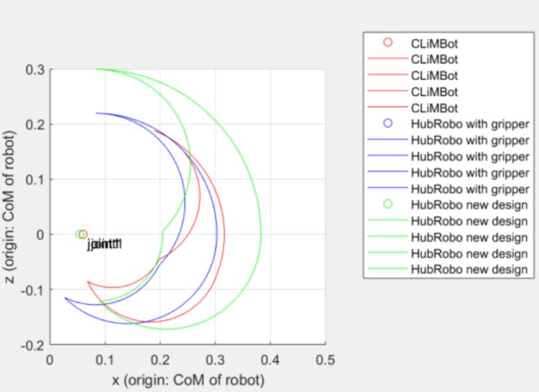
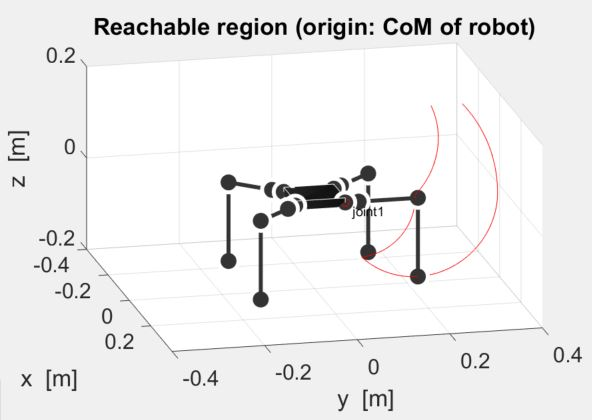

# LP_analysis

Author(s) and maintainer(s):
Kentaro Uno (unoken at dc.tohoku.ac.jp)

## Summary

 

This is the workspace to design Link Parameters (LP) of legged robot. Source code can visualize the reachability based on the LP file, which is the link parameter format used in SpaceDyn. User can easily see the reachablity of the robot by editing LP files.

## Overview 

#### Requirements
All code is confirmed to work on

* Matlab 2013 or newer

#### Current folder organization ####

```
hubrobo_description
|--README.md
|--docs/
|--tools/
|--LP_to_design/
|--main_LP_2D_analysis.m
|--main_LP_3D_analysis.m
```

## Build and Usage
Just R\run the sample_main.m for 2D or 3D visualization code, which uses some function stored in `\tools` folder. You can edit the LP files in `\LP_to_desgin `folder and see the change of reachability.


## Contribution guidelines
#### Instructive manual
For the detailed work flow under Git version control, refer to the team  instruction "[How to work in Git version control](https://docs.google.com/document/d/13-IrYbyNjKKX8clBSvSaJXkNx-QB75IRIWgK_Yo4LD4/edit)" (team member access only)
